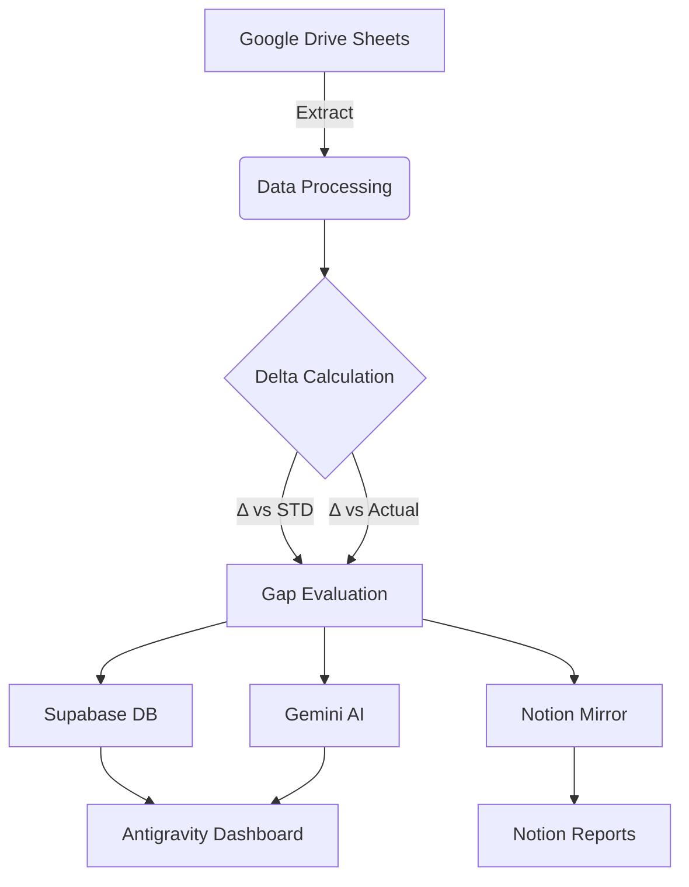

# 📜 Project Constitution: Advanded Poultry Finance Control
> AI-Powered Production Analytics Dashboard

## 🎯 North Star
An AI-powered dashboard that reads daily poultry production data from a **Centralized Google Drive Folder** (with nested Farm-level subfolders), computes Δ(actual vs. standard) AND Δ(actual vs. actual) for 5 key operational variables, flags gap warnings, and displays analytics graphs.
**Pilot Farms:** Kandang BBK & Kandang JTP.

**The Goal:** Analyze the trend of HD%, Egg Mass, FCR, Pakan, and Deplesi — and understand what those trends mean.

## 🗺️ Project Map
- **Project Name:** Advanced Poultry Finance Control
- **Design Inspo:** Glaido (Premium Aesthetic)
- **Protocol:** B.L.A.S.T.
- **Architecture:** A.N.T.
- **AI Pilot Name:** PoultryPilot

## 🎨 Brand Guidelines (Glaido)
- **Primary Color:** Lime Green `#BFF549` (Fresh, modern, energetic)
- **Neutral Colors:** White `#ffffff`, Black `#000000`
- **Typography:**
  - **Headings:** Inter Display (Regular, Medium, Bold)
  - **Body:** Inter (Regular, Bold)
- **Logo Character:** Rounded "G" / chat bubble unit (Communication + Technology).
- **Aesthetic:** High contrast, clean layouts, vibrant highlights, tech-forward.

## 📦 Delivery Payload (Antigravity)
### Page Structure
- **Page 1:** Login (Supabase Auth)
- **Page 2:** Dashboard
  - Analytics graphs: volatility (D/W/M toggle)
  - Comparison toggle: Δ Actual vs STD | Δ Actual vs Actual
  - Gap warning banner
  - AI Assistant panel (Auto-summary, Chatbot, File upload)
  - Scope: Kandang-level (Phase 2: Farm-level)

## 🪞 Notion Mirror
| Notion DB | Content | Sync Frequency |
|---|---|---|
| Weekly Production Summary | All 5 variables, Act vs Std | Weekly |
| Gap Warning Log | Variable, date, delta, severity | On trigger |
| AI Trend Report | Claude narrative | Weekly |
| File Upload Analysis | Ad-hoc results | On upload |

## ⚖️ Behavioral Rules
1. **Tone:** Professional, concise, data-grounded.
2. **AI Rules:**
   - Cite timeframe and variable in every answer.
   - Accepts free-form Q&A and file uploads (XLSX/CSV).
   - Maintains chat history per user per kandang.
3. **Data Rules:**
   - Never delete or overwrite historical data.
   - Notion sync: Asynchronous and non-blocking.
   - STD values: Read from spreadsheet columns (no UI overrides).
4. **Comparison Rules:** Supports both Δ vs STD and Δ vs Actual simultaneously.

## 🔄 Data Flow

